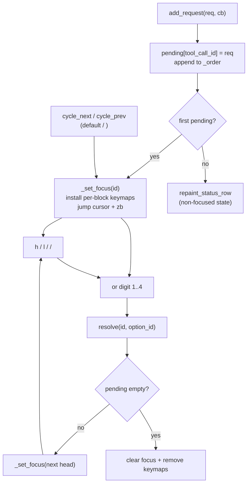

# 003. Inline permission buttons

- Status: accepted
- Last updated: 2026-05-15
- Related: `lua/agentic/ui/permission_manager.lua`,
  `lua/agentic/ui/message_writer.lua`, `lua/agentic/ui/AGENTS.md`,
  `lua/agentic/acp/AGENTS.md`

## Context

The previous permission UI was a single prompt rendered at the chat-buffer
bottom by `MessageWriter:display_permission_buttons`. `PermissionManager`
queued requests sequentially: one prompt at a time, dequeue on resolve.

Two problems:

1. **Visual disconnect.** Multiple pending tool calls collapsed into a single
   bottom prompt. The header truncated to fit (`kind(arg)` cut to buffer
   width). Users could not tie the prompt to its originating block, especially
   when the chat had scrolled past the tool call.
2. **Reanchor recursion.** Every chat mutation moved the prompt to the new
   bottom (`_reanchor_permission_prompt`). The write itself fired the
   post-mutation hook, so a `_reanchoring` flag was required to break the
   self-trigger loop. Worked, but cost a recursion guard and a stack-overflow
   trap documented in the UI AGENTS file.

ACP allows multiple concurrent `session/request_permission` calls; each
carries its own `respond_tx` oneshot. The sequential queue was a UI choice
masking protocol capability — out-of-order resolution was already supported by
the wire format.

## Current decision

One prompt per pending block, rendered as REAL TEXT on row N (the trailing
slot of the tool-call layout — see `lua/agentic/ui/AGENTS.md` "Tool-call block
layout") of each block.



### Concurrency model

- `PermissionManager.pending: table<string, PermissionRequest>` keyed by
  `tool_call_id`. Insertion-ordered `_order: string[]` for navigation.
- New arrivals appended; do not steal focus.
- `resolve(id, option_id)` removes from map + `_order`, fires callback. If the
  resolved id was focused, focus snaps to next head (oldest remaining).
- Head-tracking: focus always points at the oldest pending block.

### Two-level focus

- **Block-level** (`Config.keymaps.permission.cycle_next` /
  `cycle_prev`, default `<C-n>` / `<C-p>`): cycles `focused_id` across pending
  blocks. Buffer-local keymaps are installed only while permissions are
  pending.
- **Button-level** (`h` / `l` / `<Left>` / `<Right>`): cycles
  `focused_button_index` within the focused block. `<CR>` submits. Digits
  `1`..`4` submit option N directly.
- Button-level keymaps are installed only while a block is focused; lifecycle
  tied to `_set_focus`.

### Row-gated per-block keymaps

Motion / submit keymaps (`h`, `l`, `<Left>`, `<Right>`, `<CR>`) use
`expr = true`. On row N of the focused block they fire the action and return
`""`. Off-row they return the original key, which is replayed with `noremap`
and falls through to default Neovim behavior (cursor motion, counts,
read-only-buffer `<CR>`).

This avoids buffer-wide hijacking of `h`/`l` while a permission is pending,
without the complexity of an autocmd-driven install/uninstall lifecycle.

Digit keys `1`..`4` are NOT row-gated: they fire from anywhere in the chat
buffer. Direct dispatch is the whole point of inline permissions; gating them
to row N forces the user to scroll to the block before pressing the digit,
which defeats the feature. Digits `1`..`9` already have no useful unprefixed
meaning in the chat buffer (counts only matter as prefixes to motions, which
work normally since `0` is unbound and prefix-mode swallows digits before any
mapping triggers).

Regression test:
`lua/agentic/ui/permission_manager.test.lua::"digit keymaps fire from anywhere in the chat buffer (off-row included)"`.

### Static label map

Button labels are keyed by `PermissionOptionKind`:

```text
allow_once    -> Allow
allow_always  -> Allow Always
reject_once   -> Reject
reject_always -> Reject Always
```

Agent-supplied `option.name` is discarded. Different providers send different
strings for the same kind; rendering provider text would jitter the layout
and confuse users switching providers mid-session.

### Cursor placement

On every block-focus transition, `_jump_cursor_to(tool_call_id)`:

1. Resolves the block's `end_row` via its range extmark.
2. Resolves the first button's start column via
   `MessageWriter:get_button_col(id, 1)`.
3. Sets cursor to `(end_row + 1, first_button_col)` and `zb` anchors row
   N at the window bottom (matches chat auto-scroll convention, see
   ADR 001).

Single-pending case: `cycle_next` lands on the same `focused_id`. Instead of
no-op'ing in `_set_focus` (early return on same id), `_cycle_focus` detects
this and calls `_jump_cursor_to` directly, so the user can recall the focused
row even with one pending block.

### Auto-scroll suppression

`MessageWriter:_check_auto_scroll` stops following new output when the cursor
row contains a permission-button extmark in `NS_STATUS`. The check uses
rendered state, not `PermissionManager` focus state, so `MessageWriter` stays
decoupled from permission ownership and row shifts remain correct after block
rewrites.

### Highlight groups

Three HL groups, defined with backgrounds (button-fill look, not text-color):

```text
AgenticPermissionButtonAllow    bg = #2d5a3d (status_completed_bg), bold
AgenticPermissionButtonReject   bg = #7a2d2d (status_failed_bg),    bold
AgenticPermissionButtonInactive bg = #3a3a3a
```

Greens / reds reuse the existing status-pill palette
(`COLORS.status_completed_bg` / `COLORS.status_failed_bg`) for visual
consistency with the `pending` / `completed` / `failed` pills.

Button text is `" 1 ✓ Allow "` (leading + trailing space inside the
highlighted span). No bracket wrappers — the bg fill alone reads as a button.

### Fold interaction

Row N stays OUTSIDE the manual fold range. `Fold.close_range` is called with
`(start_row + 2, end_row)` (1-indexed inclusive), which folds 0-indexed
`top_pad..bottom_pad`. Row N (trailing / status) at 0-indexed `end_row` is
not in the fold. Buttons always visible regardless of fold state.

No change to ADR 001's manual-fold contract or anchor-pad invariants.

## Consequences

- `MessageWriter:_with_modifiable_and_notify_permission_reanchor`,
  `set_permission_reanchor_callback`, `_on_permission_reanchor`,
  `display_permission_buttons`, `remove_permission_buttons`,
  `_apply_status_footer` deleted. Six call sites migrated to plain
  `BufHelpers.with_modifiable`.
- `PermissionManager.queue` (array) + `current_request` (single ref) replaced
  by `pending` map. `_reanchoring` recursion guard gone.
- `tracker.permission: PermissionState` is the single source of truth for
  what row N renders. `MessageWriter:repaint_status_row(id)` rebuilds the
  line from the tracker; called by both update paths
  (`update_tool_call_block`, body refresh) and `PermissionManager` state
  changes.
- Auto-scroll suppression is driven by `NS_STATUS` permission-button extmarks
  on the cursor row. No focus-row callback from `PermissionManager` to
  `MessageWriter` is needed.
- `<CR>` consumed on row N of focused block. Read-only buffer default
  (next-line) was rarely useful there.
- Sticky-reading regression on focus jump: user reading farther up the
  chat gets yanked to row N on every focus transition. Accepted; the
  alternative (silent focus change) loses the visual anchor.
- Tall edit-kind diffs may scroll row N offscreen at initial render.
  `<C-n>` recovers focus + cursor.
- ADR 001 (manual folds) and ADR 002 (statuscolumn fences) unchanged.

## Rejected / superseded alternatives

| Option                                                              | Reason rejected                                                                                                                            |
| ------------------------------------------------------------------- | ------------------------------------------------------------------------------------------------------------------------------------------ |
| Sequential queue at chat bottom (previous behavior)                 | Visual disconnect on multi-block, truncated header, reanchor recursion guard.                                                              |
| Keep bottom prompt + add inline alongside                           | Two UIs, double bookkeeping, ambiguous focus model.                                                                                        |
| Click / mouse buttons                                               | Pure keyboard fits Vim; mouse handling adds OS-dependent quirks.                                                                           |
| Single focus level (block OR button)                                | Block-only loses fast direct dispatch via digits; button-only forces manual scrolling to find the right block.                             |
| Always-on `h` / `l` buffer-local keymaps                            | Hijacks normal cursor navigation while a permission is pending.                                                                            |
| Autocmd `CursorMoved` install / uninstall keymaps                   | Complex lifecycle (install/uninstall on every move); `expr=true` fall-through is a one-line equivalent.                                    |
| Snap cursor back to row N (popup-style)                             | Prevents chat scrolling while a prompt is active.                                                                                          |
| Render agent-supplied `option.name`                                 | Provider inconsistency (Claude / Gemini / Codex send different text for same kind); layout jitter on provider switch.                      |
| Bracket wrappers `[ Allow ]`                                        | Visual noise next to bg fill; user feedback during iteration.                                                                              |
| `link = "DiagnosticOk" / "DiagnosticError" / "Comment"` (fg-only)   | Reads as colored text, not buttons. User asked for bg fill.                                                                                |
| Light-bg / dark-fg button palette                                   | User chose existing dark green / red palette (`status_completed_bg`, `status_failed_bg`) for plugin-wide consistency.                      |
| `]p` / `[p` block cycle keys                                        | Both right-hand pinky, two-key sequence, awkward; user requested ergonomic alternatives.                                                   |
| `]p` / `[p` no-op when target equals current focus (single pending) | Cursor recall use case: user wants `<C-n>` to jump back to row N even with one pending. Fixed by explicit `_jump_cursor_to` in that branch. |
| Customizable digits / `h` / `l` / `<Left>` / `<Right>` / `<CR>`     | YAGNI; only `cycle_next` / `cycle_prev` are config'd. Per-block keys are conventions.                                                      |
| Original plan's `Fold.close_range(..., end_row - 1)`                | Off-by-one in plan; existing 1-indexed `end_row` already excludes row N from the fold. Changing would shrink the fold past `bottom_pad`.   |
| Fold range INCLUDES row N                                           | Buttons hidden when block folded — opposite of the goal.                                                                                   |
| Sticky cursor (no jump on focus change)                             | Loses visual anchor; user might press a digit thinking the wrong block is focused.                                                         |

## Changelog

| Date       | Commit  | Change                                                                                                                       |
| ---------- | ------- | ---------------------------------------------------------------------------------------------------------------------------- |
| 2026-05-13 | initial | Initial implementation per `docs/superpowers/inline-permission-buttons.md`. Concurrent map, head-tracking focus, row N text. |
| 2026-05-13 | -       | Two-level focus added: `h` / `l` / `<CR>` for buttons; digits kept; static label map; bg-only highlights, brackets removed.  |
| 2026-05-13 | -       | Row-gated `expr=true` keymaps; cursor positions on first button column.                                                      |
| 2026-05-13 | -       | `<C-n>` / `<C-p>` replace `]p` / `[p`; `Config.keymaps.permission.cycle_next` / `cycle_prev` made configurable.               |
| 2026-05-13 | -       | Digits `1`..`4` ungated (fire from anywhere in the chat buffer); only motion / submit keys (`h`/`l`/`<Left>`/`<Right>`/`<CR>`) remain row-gated. |
| 2026-05-14 | -       | Auto-scroll suppresses follow mode on `NS_STATUS` permission-button rows; no `PermissionManager` focus-row callback.          |
